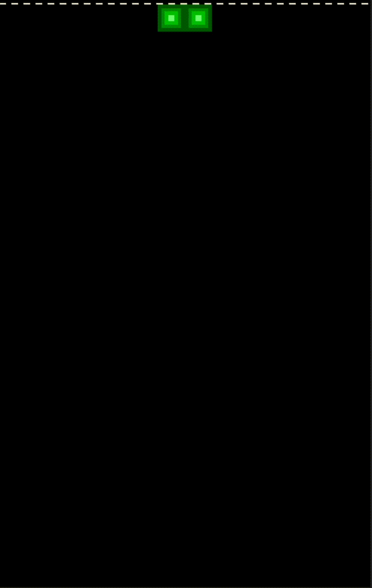

# Sandtris

"But what if it was made of sand..."

Introducing Sandtris, a physics-based twist on Tetris where blocks dissolve into sand and follow gravity upon collision!

<p align="center">
  
</p>

## Gameplay Features
- Classic Tetris gameplay... but with sand physics!
- Lines are cleared by creating a continuous span of a color of sand from wall to wall.
- Scoring system that rewards more difficult clears.

## Installation

To get started, you'll need Python 3.

1.  **Clone the repository:**
    ```bash
    git clone https://github.com/your-username/sandtrisAI.git
    cd sandtrisAI
    ```
    
2.  **Install the required packages using pip:**
    ```bash
    pip install pygame torch numpy scipy
    ```

## Usage

### Human-Playable Version
To play the game yourself, run the `player.py` script from the `player` directory:
```bash
python player/player.py
```

### AI Training
To train the AI model, run the `train.py` script from the `AI` directory:
```bash
python AI/train.py
```
*Note: Training is computationally intensive. The code is configured for Apple's MPS for Apple Silicon Macs. Use CUDA for NVIDIA GPUs or just CPU backend.*


## AI Development & Contributing

The current AI is a Convolutional Neural Network (CNN) trained with Deep Q-Learning (DQN). The model (`tetris_nn.py`) and training script (`train.py`) are located in the [`AI`](AI/) folder.

As of 8/13/25, I have paused development and training, as I need my laptop back for work reasons. I encourage you to experiment with the reward function, model architecture, and training process!

Please feel free to make a PR with your updated training scripts or saved brains! I am greatly curious as to how the reward function can be improved alongside other parts of the training process!

### If we get enough brains, we can go from a plethora of bees to a hive mind of brains!
