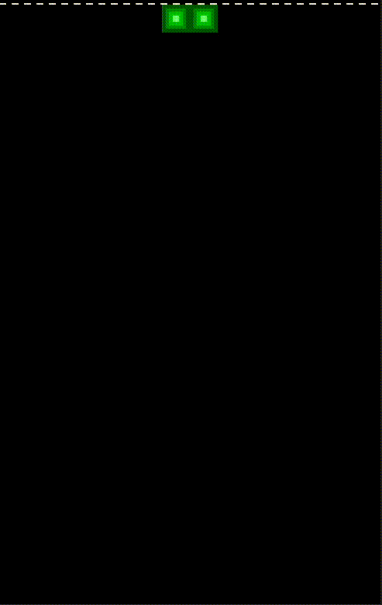

# Sandtris

_But what if it was made of sand?_

Sandtris is a playable Tetris variant where tetrominoes shatter into falling sand. Clears are not classic row clears: a region clears when same-color sand forms a continuous 4-connected path from the left wall to the right wall.

Check out the original development video on [YouTube](https://www.youtube.com/watch?v=2aehlulPRPI).

<p align="center">
  
</p>

## Features

- Tetris-style falling pieces that dissolve into grid-aligned sand.
- Deterministic wall-to-wall clear detection for connected same-color regions.
- Balanced arcade scoring with clear-size, level, combo, and soft-drop bonuses.
- Packaged Python entrypoint plus compatibility launchers for the original scripts.
- Optional AI training dependencies kept separate from the lightweight playable game.

## Install

Sandtris requires Python 3.10 or newer.

```bash
git clone https://github.com/pleth9/Sandtris.git
cd Sandtris
python -m pip install -e ".[test]"
```

For AI training support, install the optional AI extra:

```bash
python -m pip install -e ".[ai,test]"
```

## Play

Preferred entrypoint:

```bash
python -m sandtris
```

The original launcher still works:

```bash
python player/player.py
```

Controls:

- Left / Right: move the active piece.
- Down: soft drop.
- Up: rotate clockwise.
- Z: rotate counter-clockwise.
- P: pause.
- R: restart after game over.

## Clear Rules

Sandtris clears connected sand, not rigid rows.

- A clearable region must be one color.
- Connectivity is 4-way: up, down, left, right.
- The region must touch both side walls.
- Paths may bend; they do not need to be straight horizontal rows.
- Different-color sand breaks the connection.

## Scoring

Scoring lives in `sandtris.core.scoring`.

- Base points come from the number of cleared sand particles.
- Larger clears earn stronger multipliers.
- Higher levels slightly increase clear value.
- Consecutive clears add combo bonuses.
- Soft-drop points are tracked and folded into the next clear.

## Project Layout

```text
sandtris/
  core/       Grid, particles, simulation, tetrominoes, clear detection, scoring
  app/        Pygame player app
  ai/         Optional headless AI environment, observations, rewards, heuristics, trainer
player/       Compatibility launcher for the old command
AI/           Compatibility launchers for old AI commands
tests/        Headless pytest coverage for core gameplay
```

Public gameplay APIs include:

- `sandtris.core.Grid`
- `sandtris.core.Simulation`
- `sandtris.core.SandTetromino`
- `sandtris.core.find_wall_to_wall_clears`
- `sandtris.core.ScoreState`
- `sandtris.core.calculate_clear_score`

## AI Training

The AI trainer is experimental and computationally heavy. It now runs through a pygame-free headless environment with an explicit observation that includes:

- settled sand color grid
- active piece shape, color, rotation, x/y position, and board overlay
- next piece shape/color
- score, level, gravity, and ghost-row scalar context

Install the AI extra first, then run the packaged trainer:

```bash
python -m sandtris.ai.train
```

Useful short smoke run:

```bash
python -m sandtris.ai.train --episodes 1 --max-steps-per-episode 25 --checkpoint-every 0 --eval-every 0
```

## AI Evaluation And Benchmarks

Use the evaluation module to measure policies without training or replay-buffer writes:

```bash
python -m sandtris.ai.eval --policy random --episodes 50 --seed 0
python -m sandtris.ai.eval --policy heuristic --episodes 20 --seed 0
python -m sandtris.ai.eval --policy model --model-path tetris_brain_observable_v1_cs6_bs36.pth --episodes 20 --device cpu --seed 0
```

The trainer also exposes a no-training eval-only path:

```bash
python -m sandtris.ai.train --eval-only --episodes 20 --device cpu
python -m sandtris.ai.train --eval-only --episodes 20 --device mps --model-path tetris_brain_observable_v1_cs6_bs36.pth
```

Benchmark multiple policies in one run and save machine-readable metrics:

```bash
python -m sandtris.ai.eval --policies random heuristic model --model-path tetris_brain_observable_v1_cs6_bs36.pth --episodes 20 --device mps --out ai_eval_results.json --out-csv ai_benchmark.csv
```

Evaluation output reports aggregate score, median/min/max/std, pixels cleared, total reward, episode length, clear events, seed/config, device, and model path. JSON stores config plus per-episode metrics; CSV stores one row per episode.

The old top-level commands are compatibility launchers only:

```bash
python AI/train.py
python AI/headless_train.py
```

The AI package also includes deterministic heuristic utilities for bridge-potential evaluation and placement-action enumeration. These are intended as debuggable baselines before larger neural architecture work.

## Development

Run the fast headless checks:

```bash
python -m compileall sandtris tests
pytest
```

When changing gameplay, add or update tests for clear detection, sand motion, scoring, and tetromino collision behavior.
